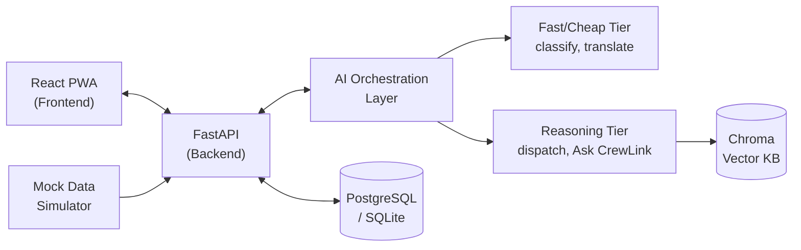

# CrewLink AI

*A mobile-first GenAI command assistant for FIFA World Cup 2026 volunteers: a live, priority-ranked task feed; AI-driven incident triage and dispatch; a real-time multilingual chat bridge; and a retrieval-grounded "Ask CrewLink" assistant — so no one on the ground is ever left guessing what to do, or stuck behind a language barrier.*

> **Status:** Implementation across 9 phases is complete. The codebase is at `backend/` (Python/FastAPI/Pydantic), `frontend/` (React/TypeScript/Vite), and `mock-simulator/`. Design docs live in `docs/`.

---

## 2. Chosen Vertical: Volunteers

CrewLink AI targets the **Volunteer** persona within Challenge 4: Smart Stadiums & Tournament Operations.

Volunteers sit at the operational center of the stadium — they respond to every incident, hold every cross-language fan conversation, and report status up to supervisors. Investing in their tools lifts the other two personas for free: fans get instant translated help through the same chat bridge a volunteer already uses, and supervisors get a live rollup from the same feed volunteers already work from. None of the other three candidate personas — Fan, Organizer, or Venue-Staff — sit at that same intersection of incident response, fan contact, and supervisor reporting, which makes Volunteers the single highest-leverage persona for this challenge.

Within that scope, the build focuses on real-time decision support, operational intelligence, and multilingual assistance, with accessibility, crowd management, and navigation as secondary threads that follow naturally once volunteers have better tools.

---

## 3. Approach & Logic: How the AI Actually Decides

CrewLink AI never hands a decision to a single "smart" model and hopes for the best. It routes work through a **two-tier, provider-agnostic AI orchestration layer**, then wraps every model call in deterministic guardrails so a hallucination can never become a wrong action in the real world.

**A. Two tiers, split by stakes and volume**
- **Fast/Cheap tier** — high-volume, low-stakes calls: incident category classification, chat translation, intent routing. These run constantly, so they need to be quick and cheap.
- **Reasoning tier** — the small number of calls that need real judgment: dispatch recommendations, "Ask CrewLink" answer synthesis, and shift-summary generation.

Both sit behind one adapter interface. No other part of the codebase names a specific AI provider or model, so the underlying model can change without touching business logic.

**B. A hard grounding boundary for anything factual**
Any question that touches facility, safety, or procedure information — "where's the nearest first-aid station," "what's the lost-child protocol" — is required, at the code level, to pass through the Chroma knowledge base first. If retrieval comes back empty or below a confidence threshold, the system won't generate an answer at all; it falls back to a visible, deterministic message instead of letting the model guess. Conversational content — translation, small talk, status updates — skips retrieval entirely, because there's nothing in the knowledge base to check it against.

**C. Dispatch logic keeps the risky part deterministic**
When an incident is reported, only the *classification* is AI-driven. The pool of possible responders is filtered down to real candidates deterministically before any model sees it, and the incident's priority score comes from a fixed formula rather than a direct model output. The Reasoning tier only ranks and recommends *among* that already-filtered, already-scored set — AI judgment is reserved for the part that's genuinely a judgment call: who's the best match, right now.

**D. Emergencies never wait on a model**
An incident flagged as requiring emergency escalation skips the Reasoning-tier recommender completely and fires a deterministic EMS/security broadcast instead — no model call sits between a medical emergency and a response. The chat bridge carries its own parallel emergency flag, so a fan who doesn't share a language with a volunteer still triggers the same instant, model-free escalation.

**E. Every model output is a schema, not free text**
All structured AI outputs are forced tool calls against a Pydantic schema, re-validated again in application code after the model responds. Every AI call site has a deterministic, visibly-badged fallback, so a failed or malformed call shows the volunteer a clearly-marked default instead of a silent guess. A 15-case golden set regression-tests all of the above in CI on every change.

---

## 4. How the Solution Works: Live Demo Walkthrough

### Primary Flow: Incident Reported → Resolved
*(Illustrated with Maria Alvarez, a bilingual Fan Experience volunteer in the East Concourse zone.)*

1. **An incident is reported** — by a volunteer, or by the mock simulator standing in for a real one. `POST /incidents` fires with a free-text description and a zone tag.
2. **Fast/Cheap classification runs synchronously**, assigning a category (medical, lost fan, translation, accessibility, crowd/queue, lost item, general) and flagging whether it needs emergency escalation.
3. **Priority is computed by a deterministic formula** — not asked of the model — so identical situations always get the identical priority.
4. **The incident lands instantly on Maria's task feed** (and everyone else's in that zone) over the `/ws/tasks` WebSocket, with REST polling as a fallback, ranked by priority.
5. **A dispatch recommendation is requested** — `POST /incidents/{id}/dispatch-recommendation`. The Reasoning tier ranks the deterministically pre-filtered pool of candidates — Maria potentially among them — and returns a best-match suggestion with its reasoning.
6. **The incident moves through its lifecycle**: Reported → Triaged → Dispatched → Acknowledged → In Progress → Resolved, with Escalated and Cancelled reachable from any point before Resolved. Every status change pushes live and always shows as color + icon + text together, never color alone.
7. **Devon, the supervisor, watches the same incident** on `/ws/supervisor`, filtered to whatever zones his JWT actually grants — no separate refresh needed.
8. **If the incident is ever flagged as an emergency**, steps 5–6 are skipped entirely: a deterministic EMS/security broadcast fires immediately, with no model call in between.

### Multilingual Chat Bridge
*(Illustrated with the fan persona, Kenji Watanabe — the whole point of this feature: Maria is fluent in English and Spanish, but not necessarily in Kenji's language, and the chat bridge closes that gap in real time.)*

1. Kenji sends a message in his own language through the chat widget.
2. `POST /chat-sessions/{id}/messages` runs it through the Fast/Cheap tier for translation only — no retrieval, no Reasoning tier — so replies stay fast.
3. Maria sees the translated text; if it touches medical, accessibility, or emergency topics, a confidence check, a back-translation, and a path to a human interpreter all kick in automatically as an extra safety net.
4. The chat carries its own `emergency_flag`, parallel to the incident pipeline's, so a language barrier never delays escalation if Kenji is describing an emergency.
5. For facility or procedure questions, either of them can ask **"Ask CrewLink"** directly — that request always routes through the same Chroma retrieval gate described above, held to the same no-hallucination standard as everything else.

---

## 5. Architecture at a Glance

A simplified view of the full system (the project's Architecture document additionally specifies the three WebSocket channels and their REST fallbacks, JWT role/zone scoping on every call, and the deterministic notification/broadcast paths):



*Simplified on purpose — full detail lives in `docs/02_System_Architecture_Document.md`, not repeated here.*

---

## 6. Tech Stack

- **Frontend:** React + TypeScript + Vite + Tailwind CSS (mobile-first PWA)
- **Backend:** Python + FastAPI + Pydantic
- **AI Orchestration:** provider-agnostic adapter — Fast/Cheap tier + Reasoning tier
- **Retrieval (RAG):** Chroma vector store
- **Database:** PostgreSQL (production) / SQLite (local & demo), via SQLAlchemy
- **Real-time:** WebSockets, with REST polling fallback
- **Auth:** JWT, scoped by role and zone
- **Testing:** Pytest + mocked LLM fixtures + golden-set evaluation
- **DevOps:** Docker Compose, GitHub Actions, free-tier deploy for the demo

---

## 7. Assumptions Made

This is a hackathon demo, built before the tournament it depicts exists, so a number of things are deliberately simulated, mocked, or descoped. Everything is disclosed here in full:

### Simulation & Mock Data
- The tournament hasn't happened yet. Every "live" signal — incidents, crowd density, volunteer position — is **simulated**: a mock engine generates them (Poisson-arrival incidents, a mean-reverting crowd-density walk, sticky-zone volunteer pings), and every one is tagged at the schema level (`SIMULATED` / `VOLUNTEER_REPORTED` / `SUPERVISOR_CREATED`) and visibly badged in the UI — never presented as real.
- The "Ask CrewLink" knowledge base is 5 authored documents (~25–40 chunks: a venue guide, two safety-procedure docs, an accessibility guide, and an FAQ) written specifically for this demo — **not** sourced from any real stadium's actual operations manual.
- Identity and login run on a simple, demo-appropriate auth scheme; there is **no integration with real FIFA ticketing or accreditation systems.**

### Scope Boundaries
- The build targets **one representative venue archetype**. Venue-specific detail lives in config and knowledge-base content, not in code, so the same system is portable to other venues without a rebuild.
- Multilingual support is **text-based, real-time translation** for this MVP; voice-to-voice translation is a stretch goal, not built.
- The knowledge base has **no live document-ingestion pipeline** in this MVP — content is static and curated, which also closes off a class of indirect prompt-injection risk.
- **Explicitly out of scope:** sustainability and transportation — both part of Challenge 4's broader theme, neither part of this build.

### Demo-Scoped Targets, Not Production Claims
- Non-functional targets — 2–6 second latency depending on feature, "100% uptime," and support for roughly 50 concurrent volunteers — describe the **scripted demo path**, not a production SLA.
- The suggested deployment (Vercel or Render for the frontend; Render Starter or Railway for the backend; an embedded Chroma instance) is sized for a **free/low-cost demo tier**, not production infrastructure.
- Data retention rules for volunteer, chat, and position data are **proposed defaults** for this MVP, not a finalized policy.
- Measuring real impact at an actual tournament is **future work** — it isn't something this build can demonstrate today.

---

## 8. Security & Testing Highlights

### Security
- **Prompt injection is designed out, not just filtered.** User text always lands in an isolated content slot the AI reads — never in the instructions the AI follows — and since the knowledge base can't be edited live in this MVP, there's no document-based path to smuggle in a malicious instruction either.
- **Zones and roles are enforced by the server, not the app.** Every request carries a signed token stating exactly which zone and role that person has; a volunteer can't see another zone's tasks, and a supervisor's rollup only ever shows what their token allows — regardless of what the frontend asks for.
- **Dispatch requests can't be gamed or replayed.** The recommendation endpoint is idempotent per incident state, so asking twice can't be used to manipulate the outcome — and a true emergency bypasses this endpoint (and its rate limit) entirely.
- **No secret ever ships in code or reaches a browser.** API keys and database credentials load only from environment variables (kept out of version control, with a checked-in `.env.example` template) or the hosting platform's own secrets manager.

### Testing
- **The test suite is shaped around AI's fuzziness, not around ignoring it.** Roughly 55% of tests are traditional, always-repeatable checks (like the incident state machine); ~25% specifically grade the AI's judgment against a fixed, 15-case benchmark on accuracy and factual groundedness — never on exact wording.
- **Every AI response must match an exact data schema before the app trusts it** — a hard, no-exceptions gate in continuous integration.
- **Five real user journeys are tested end-to-end**: the golden dispatch path, the emergency-escalation bypass, the chat bridge, the Ask CrewLink retrieval gate, and cross-zone auth/rollup — so the riskiest moments are covered, not just isolated functions.
- **Slow, expensive tests against the live AI model run nightly (or on demand) but never block a merge**, so the team ships quickly without ever shipping on unverified AI behavior. Accessibility and multilingual test coverage, initially scaffolded provisionally, was fully closed out once the accessibility spec was finalized.

---

## 9. Accessibility Highlights

- Every screen — task feed, incident detail, chat bridge, Ask CrewLink — was checked individually against WCAG 2.1 AA, and the whole app is fully operable by keyboard alone, for a volunteer who's on their feet, stressed, and possibly using only one hand.
- Priority and status are never shown by color alone; it's always color **+** icon **+** text together, and live updates announce themselves to screen readers instead of silently repainting.
- Real-time translation gets an extra safety net wherever it matters most: medical, accessibility, or emergency content adds a confidence check, a back-translation, and a path to a human interpreter — on top of, not instead of, the system's normal fact-grounding rule.

---

## 10. Setup/Run Instructions

### Prerequisites
- Python ≥ 3.11
- Node.js ≥ 20
- Docker + Docker Compose (optional, for containerized runs)

### Installation

```bash
# Backend
cd backend
pip install -e ".[dev]"

# Frontend
cd ../frontend
npm install

# Mock simulator
cd ../mock-simulator
pip install -e ".[dev]"

# Seed the database and Chroma vector store
cd ../backend
alembic upgrade head
python -c "from backend.app.seed.data import seed_all; from backend.app.db.session import SessionLocal; db = SessionLocal(); seed_all(db); db.close()"
```

### Environment Variables
Copy `.env.example` to `.env` at the repo root and adjust as needed:

| Variable | Description |
|---|---|
| `CREWLINK_DATABASE_URL` | SQLite for local dev, PostgreSQL for production |
| `CREWLINK_CHROMA_PERSIST_DIR` | Path to Chroma persistence directory |
| `CREWLINK_DEBUG` | `true` for verbose logging |
| `CREWLINK_VENUE_CODE` | Venue identifier (e.g. `founders_field`) |
| `CREWLINK_SIMULATOR_AUTH_TOKEN` | Shared secret for mock-simulator auth |

Additional optional variables: `LLM_PROVIDER_API_KEY`, `JWT_SECRET`.

### Running Locally

```bash
# Backend (at repo root or backend/)
uvicorn backend.app.main:app --host 0.0.0.0 --port 8000 --reload

# Frontend (separate terminal)
cd frontend && npm run dev

# Or use Docker Compose
docker compose up backend
```

The API is at `http://localhost:8000/api/v1/`. WebSocket channels at `/ws/tasks`, `/ws/chat/{id}`, `/ws/supervisor`.

### Running Tests

```bash
cd backend
pytest -v                          # all tests
pytest -v -k "phase8"             # Ask CrewLink tests
pytest -v tests/test_phase9/      # Supervisor dashboard tests
pytest -v tests/test_orchestration/ --run-golden  # full golden-set eval (mocked)

# Frontend
cd ../frontend && npm test
```

---

## 11. Acknowledgments

---

## 12. Deployment (Phase 12)

### Architecture (Doc #2 §6)

| Component | Platform | Tier | Rationale |
|---|---|---|---|
| Frontend (React PWA) | Render Static Site | Free | Pure CDN, no spin-down risk |
| Backend (FastAPI + Chroma) | Render Web Service | **Starter (paid)** | Persistent disk — closes Risk #3 (15-min spin-down + ephemeral fs would wipe SQLite + Chroma) |
| Vector store | Embedded in backend | — | Chroma persisted to same disk as SQLite |

Alternate: Vercel (frontend) + Railway (backend) — see `vercel.json`.

### Prerequisites

- A [Render](https://render.com) account (Starter plan for backend, free static site for frontend)
- GitHub repo secrets configured (see below)

### One-time setup

1. **Fork/clone this repo** to your GitHub account.
2. **Create a Render account** and connect your GitHub repo.
3. **In Render Dashboard:**
   - **Backend Web Service:** Use `Dockerfile.prod` (or the Python runtime directly with `startCommand: uvicorn backend.app.main:app --host 0.0.0.0 --port 10000`). Select **Starter** plan. Add a **Persistent Disk** (1 GB, mount path `/app/backend/data`). Set env vars from `.env.example`.
   - **Frontend Static Site:** Point to `frontend/` directory, build command `npm ci && npm run build`, publish directory `frontend/dist/`.
4. **In your GitHub repo Settings → Secrets and variables → Actions**, set:
   - `RENDER_API_KEY` — your Render API key
   - `RENDER_BACKEND_SERVICE_ID` — the backend service ID from Render
   - `RENDER_FRONTEND_SERVICE_ID` — the frontend service ID from Render
   - `LLM_FAST_API_KEY`, `LLM_REASONING_API_KEY`, `JWT_SECRET_KEY`, `SIMULATOR_AUTH_TOKEN` — matching `.env.example`

### Deploy

Merge to `main`. The `deploy.yml` workflow auto-deploys both services and runs the smoke test.

### Rehearsal (TDD — Doc #7 §6 mandatory pre-demo checklist)

```bash
# 1. Smoke test — basic health/readiness
bash scripts/smoke-test.sh https://your-backend.onrender.com

# 2. Idle-survival — 20 min idle, verify SQLite + Chroma survive
bash scripts/test-idle-survival.sh https://your-backend.onrender.com

# 3. Full walkthrough — twice consecutively
bash scripts/walkthrough-rehearsal.sh https://your-backend.onrender.com
```

All three must pass against the **live deployed** environment, not localhost.
The walkthrough must pass **twice in a row** before demo day.

### From a clean checkout

```bash
git clone <repo-url>
cd crewlink-ai
cp .env.example .env          # edit secrets
cd backend && pip install -e ".[dev]"
alembic upgrade head
python -c "from backend.app.seed.data import seed_all; from backend.app.db.session import SessionLocal; db = SessionLocal(); seed_all(db); db.close()"
cd ../frontend && npm install
```

---

*Built for Challenge 4: Smart Stadiums & Tournament Operations — FIFA World Cup 2026.*
