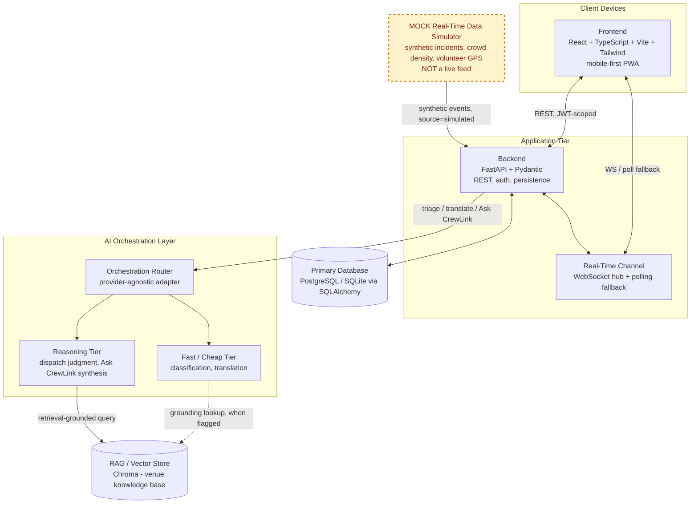
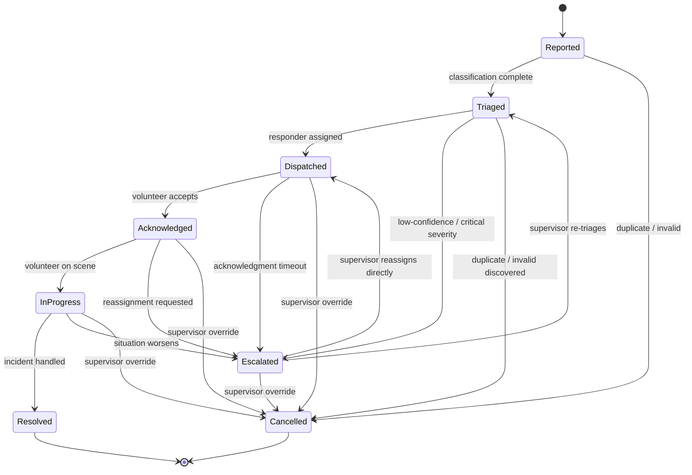

# CrewLink AI — System Architecture Document

**Doc #2 in the CrewLink AI documentation set** · Challenge 4: Smart Stadiums & Tournament Operations — Volunteer vertical
**Status:** Complete
**Companion documents:** PROJECT_INDEX.md (Doc #0), Product Requirements Document (Doc #1)

This document specifies the architecture that satisfies the Must-have stories and NFRs already fixed in the PRD. It assumes familiarity with the index and repeats persona, scope, or requirement detail only where needed to justify a design decision.

---

## 1. Architecture Style & Rationale

CrewLink AI is a three-tier, decoupled architecture: a stateless React PWA frontend, a FastAPI backend that owns persistence and request handling, and a distinct AI Orchestration Layer that mediates every call into an LLM tier or the retrieval store. None of this is a default preference — it follows from two constraints the index already fixes: a per-feature latency budget of 2–6 seconds, and a hard requirement that anything CrewLink states as fact about the venue be retrieval-grounded rather than freely generated.

**Why the AI layer is its own tier, not inline logic inside route handlers:**

- **Latency isolation.** A 2–6s band isn't one number — it's a range that has to be split across feature types. Chat translation needs to sit near the tight end to feel conversational; dispatch reasoning is allowed to spend closer to the loose end because getting it right matters more than shaving the last second. If LLM calls lived inline in FastAPI route handlers, every AI-touching route would inherit one undifferentiated timeout/retry policy. A separate orchestration layer gives the Fast/Cheap tier and the Reasoning tier their own budgets, so a slow reasoning call can never stall a task-feed read, and a translation call never waits behind a dispatch decision.
- **Grounding as an explicit, observable outcome, not an implicit one.** The RAG knowledge base is a small demo corpus, not a real venue's ops manual — misses are expected, not exceptional. Isolating retrieval behind the orchestration layer means "no relevant document found" is a typed result a caller can branch on, instead of a gap a single inline prompt might quietly paper over.
- **Provider portability.** The stack commits to a provider-agnostic adapter across two tiers. That commitment only survives if nothing outside the orchestration layer knows which vendor sits behind "fast" or "reasoning" — otherwise, swapping a provider becomes a search-and-replace across the backend instead of a config change in one place.
- **Frontend/backend split, for the reason most real-time mobile apps split it.** The PWA has to stay usable on stadium Wi-Fi, update the task feed from push events rather than reloads, and fall back to polling without a rewrite. Decoupling means the same backend surface serves the volunteer feed, the supervisor rollup, and the chat bridge without frontend concerns leaking into business logic.

One more seam is worth naming here because it recurs through the rest of this document: the Mock Real-Time Data Simulator talks to the backend through the same ingestion surface a real incident/GPS/crowd feed would use later. That's what makes "every live signal is simulated and clearly labeled" (index, Key Assumption #1) an architectural property and not just a README disclaimer — the simulator is swappable because triage, dispatch, and chat logic never know or care where an event originated.

---

## 2. Component Diagram

Two things worth calling out rather than leaving implicit:

The **Real-Time Channel** is drawn as its own component, separate from the Backend, even though it can be implemented as native WebSocket routes inside the same FastAPI/ASGI process. It earns the separation because its operational characteristics — long-lived connections, broadcast semantics, reconnection handling — are different enough from the stateless REST surface to be reasoned about, scaled, and tested on their own (see Section 8, Risk 4).

The **Mock Real-Time Data Simulator** is styled deliberately differently — dashed amber border, explicit "MOCK" prefix, explicit "NOT a live feed" label — and it only ever talks to the Backend, never directly to the AI Orchestration Layer or the Frontend. That restriction is intentional: everything downstream of the Backend treats a simulator-originated incident exactly like a human-reported one, which is what keeps the demo honest without needing special-cased logic anywhere else in the system.

---

## 3. Critical Path Walkthrough — AI Triage & Dispatch

Tracing one incident end to end, with the model tier — or lack of one — at each step:

**Step 0 — Incident reported.** *(No model tier — deterministic write.)*
An incident originates either from a volunteer or fan submitting it through the Frontend, or — since the tournament hasn't happened yet — from the Mock Real-Time Data Simulator injecting a synthetic event into the Backend's ingestion endpoint, tagged `source: "simulated"`. Either way, the Backend persists it to the Primary Database in the `Reported` state (Section 5) and hands the payload to the Orchestration Router.

**Step 1 — Classification.** *(Fast/Cheap tier.)*
The Router sends the incident text and metadata (zone, timestamp, reporter role) to the Fast/Cheap tier for structured, Pydantic-validated output: category (medical, security, lost-child, facilities, guest-services, etc.), severity, and a `needs_grounding` flag. This belongs on the fast tier because it runs on *every* incident regardless of volume, the output shape is bounded and schema-constrained, and it needs to land at the low end of the latency band so the rest of the pipeline still has budget left. Misclassification risk is better handled with good few-shot examples and a confidence score than with a slower, heavier model.

**Step 2 — Knowledge-base lookup.** *(Conditional; retrieval only, no generation.)*
Only incidents where classification set `needs_grounding: true` — an embedded procedural question, or severity above the auto-escalate threshold — query the RAG/Vector Store. This is a similarity search, not a model call, so it doesn't draw on either tier's latency budget; the cost here is retrieval, not reasoning. Because the knowledge base is a small seeded demo corpus by design, a miss is an expected, first-class outcome: the layer returns `no relevant document found` rather than letting a later step invent SOP content that was never in the corpus. Dispatch proceeds either way.

**Step 3 — Dispatch recommendation.** *(Reasoning tier.)*
The Reasoning tier receives the classified incident, any retrieved SOP context, and the live candidate pool — zone-eligible volunteers with skill/language tags and current open-task load — and returns a ranked recommendation with a rationale. This is where the slower, stronger tier earns its cost: it's a multi-factor judgment call (proximity, load balancing, language/skill match, retrieved procedure, severity) over a wider context, a wrong call has real operational cost, and the rationale itself is what later renders in Devon's supervisor rollup. This step is allowed to spend toward the top of the 2–6s band precisely because Step 1 spent as little of it as possible.

**Step 4 — Volunteer notified.** *(No model tier — deterministic persist-and-push.)*
The Backend writes the assignment, advances the incident to `Dispatched` (Section 5), and pushes it through the Real-Time Channel to the matched volunteer's session, re-ranking their task feed. Nothing here calls a model.

Net shape of the pipeline: the Fast/Cheap tier runs exactly once per incident (mandatory), the vector store runs at most once (conditional, non-generative), and the Reasoning tier runs exactly once (mandatory) — the common case stays cheap, and the expensive judgment call only fires where judgment is actually needed.

---

## 4. Multilingual Chat Bridge Data Flow

A shorter path, and deliberately a simpler one:

1. **Message sent.** A participant — Maria or a fan such as Kenji — sends a message in their own language through the Frontend, over the Real-Time Channel, to the Backend.
2. **Translation.** *(Fast/Cheap tier only.)* The Backend forwards the text and the source/target language pair to the Orchestration Router, which routes to the Fast/Cheap tier — the same tier used for classification in Section 3, for the same reason: translation runs on every message in both directions, and needs to feel conversational, so it sits at the tight end of the latency band. There is no escalation path to the Reasoning tier, and the RAG/Vector Store is never consulted on this path: unlike triage or Ask CrewLink, chat translation isn't grounded in venue knowledge — it's a linguistic conversion.
3. **Delivery.** The translated text streams back through the Backend and the Real-Time Channel to the recipient's Frontend, rendered alongside (or toggleable to) the original. Both strings persist to the Primary Database as a transcript pair, available to Devon's supervisor rollup.

The asymmetry with Section 3 is intentional and worth stating plainly: not every AI feature touches every component. The Chat Bridge never touches the Reasoning tier or the vector store — one tier, no retrieval, minimal branching — which is exactly why it can hit the tight end of the budget on every single message rather than the loose end on a few.

---

## 5. State Management — Incident/Task Lifecycle

**States**

| State | Meaning |
|---|---|
| `Reported` | Incident logged (human-submitted or simulator-injected); awaiting classification |
| `Triaged` | Classification complete (category, severity, zone); awaiting a dispatch match |
| `Dispatched` | Best-match volunteer recommended and notified; awaiting acknowledgment |
| `Acknowledged` | Volunteer has accepted the task |
| `InProgress` | Volunteer is actively working the incident on-scene |
| `Resolved` | Closed successfully — **terminal** |
| `Escalated` | Kicked to supervisor review — timeout, low-confidence triage, or on-scene worsening |
| `Cancelled` | Invalidated as duplicate or false alarm — **terminal** |

**Valid transitions**

| From | To | Trigger |
|---|---|---|
| Reported | Triaged | Fast/Cheap tier classification succeeds |
| Reported | Cancelled | Confirmed duplicate/invalid before triage |
| Triaged | Dispatched | Reasoning tier recommendation accepted, volunteer notified |
| Triaged | Escalated | Low classification confidence, or severity crosses auto-escalate threshold |
| Dispatched | Acknowledged | Volunteer accepts within the acknowledgment SLA |
| Dispatched | Escalated | Acknowledgment SLA times out |
| Acknowledged | InProgress | Volunteer marks arrival / start |
| Acknowledged | Escalated | Volunteer flags inability to handle it, requests reassignment |
| InProgress | Resolved | Volunteer marks the incident handled |
| InProgress | Escalated | On-scene severity increases |
| Escalated | Triaged | Supervisor sends it back for re-triage |
| Escalated | Dispatched | Supervisor manually reassigns without a full re-triage |
| *any non-terminal state* | Cancelled | Supervisor/system override |

---

## 6. Deployment View

### Local development — Docker Compose

- **`frontend`** — Vite dev server, hot reload.
- **`backend`** — FastAPI/uvicorn with `--reload`. The SQLite file and Chroma's persistence directory are both mounted as local volumes. Chroma runs **embedded in-process** (the open-source `chromadb` persistent client pointed at a local directory) rather than as its own service — it's genuinely free, adds no extra container, and matches the scale of a small seeded knowledge base.
- **`mock-simulator`** — a standalone service posting synthetic incident/crowd/GPS events to the backend's ingestion endpoint on a timer, exactly the way a real feed would later (Section 1). It runs as its own container rather than a background task inside `backend`, which keeps the "swap it out later" seam real instead of theoretical.
- No separate database container: SQLite is a file, not a service, for both local dev and the demo. Postgres is deferred to a real, post-tournament deployment that's explicitly out of scope here.

### Demo deployment

The constraint that matters most here isn't cost — nearly everything below is free or close to it — it's that the NFR log already commits to 100% uptime across the scripted demo path, and two of the obvious "free" choices work against that if used carelessly.

- **Frontend:** Vercel's free Hobby tier for the built static PWA — no card required, generous bandwidth, and a pure static/CDN deployment, so none of the backend caveats below apply. Render's free static-site hosting is a functionally equivalent alternative if the team would rather keep frontend and backend on one dashboard.
- **Backend:** this is the service that needs a long-lived process for native WebSocket support, which rules out purely serverless platforms outright. Render's free web-service tier does accept inbound WebSocket connections, but it spins down after 15 minutes without traffic (about a minute to cold-start back up), and its filesystem is ephemeral — a redeploy, restart, or spin-down wipes the SQLite file and the embedded Chroma index along with it. That's a fine trade during ordinary development; it's a direct threat to the uptime NFR if it happens mid-demo. Closing that gap doesn't take code, just an infrastructure choice for the demo window itself: run it on Render's paid Starter tier (persistent disk included) for the day of the demo, or use Railway instead, whose usage-based low tier doesn't cold-start and comfortably covers a small FastAPI service within its included monthly credit.
- **Vector store:** stays embedded in the Backend process, persisted to the same small disk as the SQLite file — free, since the open-source Chroma library carries no hosting cost on its own. Chroma Cloud's managed tier is a documented upgrade path if the vector store ever needs to survive backend redeploys independently, but it's unnecessary at this corpus size.
- CI/CD stays as already decided: GitHub Actions builds and deploys on merge to `main`, targeting whichever of the above is currently live.

**Sources (verified July 2026):**
- [Render — free-tier spin-down and ephemeral filesystem behavior](https://render.com/docs/free)
- [Render — WebSocket support](https://render.com/docs/websocket)
- [Fly.io — free-trial policy and pricing](https://fly.io/docs/about/pricing/)
- [Chroma — self-hosted vs. Chroma Cloud pricing](https://www.trychroma.com/pricing)

---

## 7. Scalability & Multi-Venue Note

Pointing CrewLink AI at a second stadium should touch only data and configuration, not code — that's the entire point of Key Assumption #2 in the index. The zone/geofence topology (zone names, section-to-zone mapping, coordinates) moves from hardcoded values to a per-venue config record loaded at startup, and the JWT zone-claim schema simply grows to include the new zone list rather than changing shape. The RAG knowledge base gets a second, separately namespaced document set seeded with the new venue's procedures — retrieval logic never referenced Founders Field by name, so nothing there needs to change. The volunteer roster and skill/language tags get reseeded as new demo data, the Mock Real-Time Data Simulator's scenario templates (incident mix, crowd-density curve, gate/section counts) move from literals to venue-scoped config, and the Chat Bridge's supported language-pair list expands additively instead of being rewritten. If any of those five surfaces turns out to be hardcoded when a second venue is actually attempted, that's the one thing worth treating as a bug against this architecture — not an expected cost of expanding it.

---

## 8. Key Architectural Risks

| # | Risk | Mitigation |
|---|---|---|
| 1 | Sparse, seeded RAG corpus produces retrieval misses or false confidence in grounding | Treat "no relevant document found" as a typed, expected outcome that degrades to structured-signal-only dispatch/answers — never a gap for the model to fill in |
| 2 | Reasoning-tier latency variance breaks the 2–6s budget on the dispatch step | Hard per-call timeout with a deterministic (nearest-zone) fallback recommendation if the tier doesn't respond in time |
| 3 | Free-tier hosting quietly threatens the "100% of the scripted demo path" NFR (spin-down + ephemeral filesystem wipe the SQLite file and Chroma index on restart) | Run the live demo window on a paid Starter instance or Railway with persistent storage — free tier is fine for development, not for the demo itself |
| 4 | Real-time channel drops on volunteer mobile networks silently stale the task feed | Polling fallback (already in the stack) plus idempotent state reconciliation on reconnect — the client re-fetches a current snapshot rather than trusting only the missed event stream |
| 5 | Mock simulator output gets mistaken for a live signal, undermining the demo's own honesty commitment | Tag every simulator-originated record `source: "simulated"` at the schema level, not just architecturally, so it's visible in the data and the UI, not only the diagram |

---

--- INDEX UPDATE ---

- **Architecture finalized:** decoupled Frontend (React PWA) / Backend (FastAPI) / distinct AI Orchestration Layer, linked via JWT-scoped REST and a WebSocket channel with polling fallback.
- **AI Orchestration Layer:** one provider-agnostic router exposing two tiers — Fast/Cheap (classification, translation) and Reasoning (dispatch judgment, Ask CrewLink synthesis).
- **Triage & Dispatch critical path:** classification → Fast/Cheap tier; KB lookup → Chroma retrieval, conditional and non-generative; dispatch recommendation → Reasoning tier; notification → deterministic push, no model.
- **Chat Bridge:** Fast/Cheap tier only, no RAG involvement.
- **Mock Real-Time Data Simulator:** formalized as its own component, feeding the Backend only, schema-tagged `source: simulated`.
- **Incident lifecycle:** Reported → Triaged → Dispatched → Acknowledged → InProgress → Resolved, with Escalated/Cancelled reachable from every non-terminal state.
- **Demo deployment:** Vercel or Render (frontend), Render Starter or Railway (backend — protects the uptime NFR), embedded Chroma (vector store).
