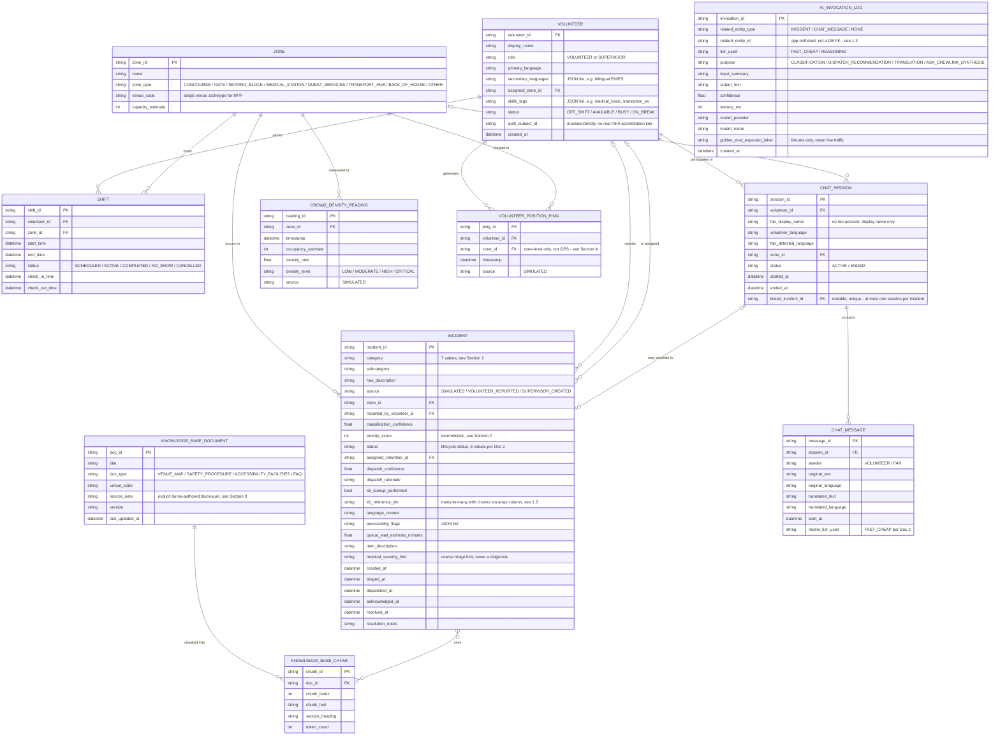

# Doc #3 — Data Model & Mock-Data Strategy Document

**Project:** CrewLink AI — FIFA World Cup 2026 Volunteer Command Assistant
**Vertical:** Smart Stadiums & Tournament Operations — Volunteer (primary persona: Maria Alvarez)
**Builds on:** Doc #1 (Product Requirements Document), Doc #2 (System Architecture Document)
**Author role:** Staff Data Engineer
**Status:** Complete

This document defines the persisted data model behind the live task feed, AI triage-and-dispatch pipeline, multilingual chat bridge, and Ask CrewLink RAG assistant, and specifies exactly how every simulated signal in the demo is generated and disclosed as synthetic. Per Key Assumption #1 in PROJECT_INDEX.md, the tournament has not happened yet: every incident, crowd reading, and volunteer position in this system is generated data, and this document treats that as a schema-level concern, not a UI afterthought.

---

## 1. Entity List & Relationships

### 1.1 Entities

Six entities were specified directly: **Volunteer, Zone, Incident/Task, Shift, KnowledgeBaseDocument, ChatSession.** Five more are added because Doc #2's architecture requires them; each is justified below rather than assumed.

| Added entity | Why it's here, not invented |
|---|---|
| `ChatMessage` | Doc #2 gives the Chat Bridge its own critical-path role ("Fast/Cheap tier only, no RAG involvement"). `ChatSession` is a container; the actual translated turns — original text, detected language, translated text — need a row each, or the bridge can't be audited turn-by-turn. |
| `KnowledgeBaseChunk` | Doc #2 names Chroma specifically as the vector store. A vector store indexes chunks, not whole documents, so retrieval granularity needs its own record — this is also where Section 3's chunking plan actually lives. |
| `CrowdDensityReading` | Doc #2 formalizes the "Mock Real-Time Data Simulator... schema-tagged source: simulated" as its own component. Crowd density is one of the three signals this document is explicitly asked to spec generation for (Section 4). |
| `VolunteerPositionPing` | Same justification — the simulator's second named signal. |
| `AIInvocationLog` | Doc #2's AI Orchestration Layer is "one provider-agnostic router exposing two tiers," and the tech stack names a golden-set eval. Both need somewhere to record which tier handled a call, at what confidence, and at what latency — otherwise the NFR latency targets and the eval harness have nothing to measure against. |

Three things were deliberately **not** added, to keep this from over-building past what Docs #1–#2 actually describe:

- **No separate `Supervisor` entity.** Doc #2 scopes JWT auth "by role and zone." Devon Price is a `Volunteer` row with `role = SUPERVISOR` — same table, same auth path, just a different rollup view over the same data.
- **No separate `Fan` entity.** Key Assumption #4 rules out any real accreditation/identity integration for fans; Kenji-type participants show up only as the unauthenticated far side of a `ChatSession` (`fan_display_name`, `fan_detected_language`). A full identity table would model an integration this project explicitly isn't building.
- **No separate `AskCrewLinkQuery` entity.** Ask CrewLink questions are single-shot Q&A with no lifecycle or status — they're logged as `AIInvocationLog` rows (`purpose = ASK_CREWLINK_SYNTHESIS`) rather than getting their own table.

### 1.2 ERD

`AI_INVOCATION_LOG` is drawn with no relationship lines — see 1.3 for why.

### 1.3 Modeling notes worth flagging

- **`INCIDENT` ↔ `KNOWLEDGE_BASE_CHUNK` is a real many-to-many**, but at the physical layer it's a Postgres/SQLite array column (`kb_reference_ids` on `INCIDENT`) rather than a join table. That's a deliberate simplification for a demo-scoped project — a join table (`incident_kb_reference`) would be the more normalized choice if citation-tracking ever became a production feature, since a native array column can't carry a real foreign-key constraint the way a join table can.
- **`AI_INVOCATION_LOG.related_entity_id` is polymorphic** — it points at an `INCIDENT` row, a `CHAT_MESSAGE` row, or nothing at all for Ask CrewLink queries. Polymorphic associations can't be expressed as one clean relationship line or enforced as a native FK, so drawing one anyway would overstate referential integrity that doesn't exist. It's enforced at the application layer instead, and that's called out here rather than glossed over.
- **`CHAT_SESSION.linked_incident_id`** carries a uniqueness constraint, not just nullability, so at most one chat session is ever recorded as the origin of a given incident — otherwise "which conversation produced this incident" becomes ambiguous.

### 1.4 Physical storage notes (Postgres prod / SQLite local)

The stack is SQLAlchemy over Postgres in prod and SQLite locally, and a few field types don't travel identically across both:

- **Enums** (`role`, `status`, `category`, etc.): recommend `VARCHAR` + `CHECK` constraint via SQLAlchemy's `Enum` type, rather than a native Postgres `ENUM`. Native Postgres enums need `ALTER TYPE` for schema changes, which is friction this project doesn't need while the category/status lists can still move pre-tournament.
- **List-like fields** (`secondary_languages`, `skills_tags`, `accessibility_flags`, `kb_reference_ids`): recommend SQLAlchemy's `JSON` column type uniformly, rather than Postgres `ARRAY`. Postgres `ARRAY` has no SQLite equivalent, and a type that only works in prod is a bug waiting to happen the first time someone runs against the local SQLite DB.
- **IDs**: application-generated string UUIDs (Python `uuid4()`), not DB-side `gen_random_uuid()` — again so local SQLite and prod Postgres behave identically.
- **Timestamps**: always stored and compared in UTC. Postgres gets `TIMESTAMPTZ`; SQLite has no timezone-aware type, so the application layer is responsible for always writing and reading ISO-8601 UTC strings there.

---

## 2. Incident/Task Schema Deep-Dive

### 2.1 Where the classifier's job starts and stops

The triage-and-dispatch critical path in Doc #2 has four stages, and it matters which one writes which field — otherwise "the AI" looks responsible for things it never touched:

1. **Classification (Fast/Cheap tier)** — reads the incoming report, writes `category`, `subcategory`, `classification_confidence`, and a handful of category-specific fields (below).
2. **KB lookup (Chroma, conditional, non-generative)** — reads `category`, writes `kb_lookup_performed` and `kb_reference_ids`. No model call at all; this is a retrieval step.
3. **Dispatch recommendation (Reasoning tier)** — reads `category`, `zone_id`, any KB context, and the current `Volunteer` roster (`status`, `skills_tags`, `assigned_zone_id`); writes `assigned_volunteer_id`, `dispatch_confidence`, `dispatch_rationale`.
4. **Notification (deterministic push, no model)** — reads `assigned_volunteer_id`; writes nothing on `Incident` itself.

`priority_score` is **deliberately not** a raw model output. It's computed by a small deterministic function (`category` base severity + current `CrowdDensityReading` for the zone + queue wait time) rather than an LLM call, for three reasons: it's explainable to a supervisor without asking the model to justify itself, it's cheap to recompute on every re-rank of the task feed, and it's the kind of thing a golden-set eval can check exactly rather than approximately.

### 2.2 Full field table

| Field | Type | Classifier reads it? | Classifier writes it? | Actually written by | Notes |
|---|---|---|---|---|---|
| `raw_description` | text | **Yes — primary input** | No | Volunteer / kiosk / simulator | The only free-text the classifier sees. |
| `source` | enum | Yes (context) | No | System | Doesn't affect classification; lets golden-set eval segment accuracy by real vs. simulated input. |
| `zone_id` | FK | Yes (context) | No | System | `zone_type` (e.g., already near `MEDICAL_STATION`) can inform classification. |
| `category` | enum (7) | — | **Yes** | Classifier | Core output — see 2.3 for the seven values. |
| `subcategory` | string, nullable | — | **Yes** | Classifier | Free-ish nuance, e.g. "chest pain" under `MEDICAL`. |
| `classification_confidence` | float 0–1 | — | **Yes** | Classifier | Below a configured threshold, a Should-tier story routes to human review instead of auto-dispatch. |
| `language_context` | string, nullable | — | **Yes, conditionally** | Classifier | Populated only when `category` is `LOST_FAN` or `TRANSLATION_REQUEST`. |
| `accessibility_flags` | list, nullable | — | **Yes, conditionally** | Classifier | Populated only when `category = ACCESSIBILITY`. |
| `medical_severity_hint` | enum, nullable | — | **Yes, conditionally** | Classifier | Populated only when `category = MEDICAL`. Coarse (LOW/MED/HIGH) and explicitly a triage hint — the classifier flags urgency, it never attempts a diagnosis or treatment suggestion. |
| `item_description` | string, nullable | — | **Yes, conditionally** | Classifier | Populated only when `category = LOST_ITEM`; a normalized fragment of `raw_description`. |
| `queue_wait_estimate_minutes` | float, nullable | No | No | Deterministic scorer (reads latest `CrowdDensityReading` for the zone) | Populated only when `category = CROWD_QUEUE`. |
| `priority_score` | int | No | No | Deterministic scorer | See 2.1 rationale. |
| `kb_lookup_performed` / `kb_reference_ids` | bool / list | No | No | KB Lookup stage (reads `category`) | True only for categories where retrieval adds value — see 2.3. |
| `assigned_volunteer_id`, `dispatch_confidence`, `dispatch_rationale` | FK / float / text | No | No | Reasoning tier | Reads roster state, not just the incident. |
| `status`, `*_at` timestamps | enum / datetime | No | No | System state machine (Doc #2 lifecycle) | `status` moves to `TRIAGED` the moment stage 1 finishes, regardless of category. |
| `resolution_notes` | text, nullable | No | No | Volunteer, on resolve | Human-authored, not model-authored. |

Not shown above because no AI stage ever touches them: `incident_id` (system-generated at creation) and `reported_by_volunteer_id` (populated from session/reporter context before classification runs — useful for audit, not read by the classifier itself).

### 2.3 Per-category behavior

These seven categories are used here as the finalized `Incident.category` values; they track closely with the scope and personas Docs #1–#2 already established (multilingual bridge, accessibility as secondary scope, crowd management as secondary scope).

| Category | Classifier-populated nuance field(s) | KB lookup? | Typical dispatch match |
|---|---|---|---|
| `MEDICAL` | `medical_severity_hint` | No — speed-critical, skip Chroma | `skills_tags` has `medical_basic` / `medical_certified`; nearest `MEDICAL_STATION`-zone volunteer preferred |
| `LOST_FAN` | `language_context` | Conditional (venue map chunks, for directing back to seat/gate) | Guest Services role, or matching `skills_tags` language |
| `TRANSLATION_REQUEST` | `language_context` | No | Matching bilingual `skills_tags` — this is the **human-escalation** path, distinct from the always-on automated `ChatSession` bridge (see 2.4) |
| `ACCESSIBILITY` | `accessibility_flags` | Yes (accessibility facilities doc) | `skills_tags` has `accessibility_trained` |
| `CROWD_QUEUE` | `queue_wait_estimate_minutes` (scorer, not classifier) | No | Any `AVAILABLE` volunteer in-zone or adjacent; often multiple dispatched |
| `LOST_ITEM` | `item_description` | Conditional (FAQ doc — lost-and-found procedure) | Guest Services role, any `AVAILABLE` volunteer |
| `GENERAL` | — | Conditional (FAQ doc) | Any `AVAILABLE` volunteer — see 2.4 for what this is *not* |

### 2.4 Two things this taxonomy could get confused with

- **`TRANSLATION_REQUEST` vs. the `ChatSession` bridge.** The bridge is always-on, automated, Fast/Cheap-tier translation for any volunteer-fan interaction. `TRANSLATION_REQUEST` as an `Incident` category is the opposite: a volunteer explicitly asking for a **human** bilingual volunteer to be dispatched in person, for situations text translation doesn't cover well (no shared device, a complex in-person situation, someone who needs a live interpreter rather than a screen). Same underlying skill, different delivery mechanism — worth keeping distinct so dispatch logic doesn't conflate them.
- **`GENERAL` incident vs. an Ask CrewLink question.** `GENERAL` is a volunteer-reported task that doesn't fit the other six ("need extra chairs at Gate C," "spill needs cleanup") — it still goes through the full triage/dispatch lifecycle and gets a responder. An Ask CrewLink query ("what's the re-entry policy?") never becomes an `Incident` at all; it's a single-shot question answered via KB retrieval plus the Reasoning tier and logged only in `AIInvocationLog`. They can look similar in free text but they're structurally different things.

---

## 3. Knowledge Base Corpus Plan

### 3.1 What's in the corpus, and why that's enough

Per Key Assumption #5, this corpus is **authored for this demo** — representative content written to exercise the retrieval pipeline, not sourced from, adapted from, or standing in for any real stadium's actual operations manual. Every `KnowledgeBaseDocument.source_note` says so explicitly (e.g., *"Authored for the CrewLink AI demo; not derived from any real venue's operations manual"*), so the disclosure travels with the data itself, not just the README.

| `doc_type` | Doc(s) | Covers | Feeds which category (2.3) |
|---|---|---|---|
| `VENUE_MAP` | 1 — "Founders Field Zone Guide" | Prose description of zones, adjacencies, and landmarks (concourses, gates, medical stations, guest services, restrooms, lost-and-found) | `LOST_FAN` |
| `SAFETY_PROCEDURE` | 2 — "Medical Escalation Overview," "Crowd & Evacuation Overview" | **Operational escalation procedure only** — who to notify, what to relay, wait for a certified responder. Deliberately not clinical/treatment content; volunteers escalate, they don't treat. | Supports the human process; not a live KB-lookup category, since `MEDICAL` skips retrieval for speed |
| `ACCESSIBILITY_FACILITIES` | 1 — "Accessibility Services & Facilities Guide" | Wheelchair routes, accessible restrooms, sensory-friendly room, assistive listening pickup, accessible seating | `ACCESSIBILITY` |
| `FAQ` | 1 — "Founders Field Guest FAQ" | Bag policy, re-entry, lost-and-found hours, Wi-Fi, prohibited items | `LOST_ITEM`, `GENERAL`, Ask CrewLink |

**Five documents.** That's the number that lets every conditional KB-lookup branch in Section 2 retrieve against real content, and lets the scripted demo path (Doc #1's 100%-uptime-on-the-script NFR) hit a good match on every question the script actually asks — which is the real credibility bar here, not stadium-scale completeness. Deliberately **not** included, because it wouldn't add demo value: a document per seating section, exhaustive legal/policy text, or clinical medical content.

One more minimization move: the corpus is authored in **English only**. Translation happens at query time — the Reasoning tier translates the synthesized answer, same as any other Ask CrewLink output — so there's no need to maintain parallel per-language source documents; that would double the authoring effort for a capability the runtime pipeline already provides.

### 3.2 Chunking

- **Unit of chunking: heading-based, not a fixed-token sliding window.** Every source document is short (roughly 300–800 words) and hand-authored with clear section headings (per zone, per facility, per FAQ question), so splitting on headings produces self-contained retrieval units that match how a volunteer actually asks a question — "where's accessible parking" retrieves exactly the accessible-parking section, not a window that starts mid-sentence.
- **Target chunk size:** roughly 150–300 tokens. Small enough for precise retrieval, large enough to stand alone without its heading.
- **FAQ documents specifically:** one chunk per Q&A pair — the natural atomic unit.
- **Overlap:** none by default, since heading-based splitting avoids mid-thought breaks by construction. If any single section runs long enough to need a secondary split, a defensive ~20-token overlap is the fallback, not the default.
- **Expected volume:** roughly 25–40 chunks total across all five documents (venue guide ≈ 8–10 zone entries, two safety docs ≈ 6–8 sections combined, accessibility guide ≈ 6–8 facility entries, FAQ ≈ 10–15 Q&A pairs).
- **Chroma vs. relational store:** Chroma is the source of truth for embeddings and nearest-neighbor search (embedded, per Doc #2's deployment note). `KnowledgeBaseChunk` in Postgres/SQLite is a lightweight mirror of `chunk_text` and metadata, kept so `Incident.kb_reference_ids` can join back to human-readable chunk content without querying Chroma just for display purposes.

---

## 4. Mock Real-Time Data Generator Spec

Doc #2 formalizes the Mock Real-Time Data Simulator as its own component feeding the backend, schema-tagged `source: simulated`. This section is the exact spec for the three signals it produces, and — because that label only matters if it's actually unmissable — exactly how each one surfaces as visibly fake.

### 4.1 Simulated Incidents

- **Arrival process:** Poisson — the standard, defensible model for independent, randomly-timed arrival events. Mean inter-arrival time is a config value (e.g., λ ≈ 1 incident per 45–90 seconds during an "active" demo window), not hardcoded, so a demo operator can retune the pace live.
- **Category distribution:** a weighted random draw across the seven categories in 2.3, not uniform. An illustrative config default:

  | Category | Weight |
  |---|---|
  | `GENERAL` | 25% |
  | `CROWD_QUEUE` | 20% |
  | `LOST_FAN` | 15% |
  | `LOST_ITEM` | 15% |
  | `TRANSLATION_REQUEST` | 10% |
  | `ACCESSIBILITY` | 10% |
  | `MEDICAL` | 5% |

  **These weights are illustrative config defaults chosen to make the demo feel realistic, not researched real-world incident statistics** — no real tournament has happened yet (Key Assumption #1), so there is no real distribution to calibrate against. They live in a config file specifically so they're visibly a knob, not a claimed fact.
- **`raw_description` generation:** templated sentence construction with slot-filled vocabulary per category (e.g., a `MEDICAL` template pulls from a short illustrative symptom list), **not** a live LLM call per generated incident. This keeps the generator fast, cheap, and demo-reliable, and it means every simulated report is obviously templated on inspection rather than dressed up to look like a real transcript.
- **Zone assignment:** weighted by `Zone.capacity_estimate` (bigger zones get proportionally more incidents) rather than uniform, since that's a closer approximation of where people actually cluster.
- **Realistic variability:** the Poisson process itself supplies jitter; on top of that, a config toggle enables a "burst mode" (e.g., a simulated post-goal surge in `CROWD_QUEUE` and `LOST_FAN` incidents) for demo storytelling.

### 4.2 Crowd Density Readings

- **Sampling:** fixed interval per zone (e.g., every 15–30 seconds), not Poisson — density is a continuously-sampled metric, not a discrete arrival event, so a periodic model is the correct fit here, distinct from the incident generator's choice above.
- **Value generation:** a bounded, mean-reverting random walk (each reading = previous reading + small random delta, clamped to `[0, capacity_estimate]`, drifting toward a time-of-day baseline) rather than independent random noise per tick — real crowd density drifts, it doesn't teleport.
- **The baseline curve itself** (low pre-match, peak at kickoff/halftime, spike at final whistle) is an **illustrative authored shape**, not derived from real attendance data — again, because no such data exists yet for this tournament.
- **`density_level` thresholds** (e.g., <40% `LOW`, 40–70% `MODERATE`, 70–90% `HIGH`, >90% `CRITICAL`) are demo config defaults. A real deployment would need these set by actual venue safety engineers, not inherited from this document.

### 4.3 Volunteer Position Pings

- **Ping interval:** fixed, per active volunteer (e.g., every 20–40 seconds while `Shift.status = ACTIVE`) — a periodic heartbeat, which is a reasonably realistic simulacrum of how a real presence-ping system behaves, even though the underlying values are fake.
- **Movement model:** each simulated volunteer has a "home" zone (their `Shift.zone_id`) with a small per-tick probability (≈10–15%) of transitioning to another zone, otherwise staying put — a sticky, Markov-chain-like model rather than a fresh random zone every tick, since real volunteers mostly stay at their post.
- **Zone-level only, no lat/long.** This isn't a simplification of convenience — indoor GPS is unreliable inside a stadium bowl, and zone-level is the actual granularity dispatch logic consumes (matches `Zone`-scoped JWT auth and the per-zone task feed). Not simulating coordinates that would be fake in a more elaborate way is itself a minimization choice, not just a shortcut.

### 4.4 Labeling — how this never gets mistaken for a live feed

- **Schema level:** `source` is a required (non-nullable) field on `Incident`, `CrowdDensityReading`, and `VolunteerPositionPing`. It's the ground-truth label because it's a real column, not a UI convention that can silently be dropped.
- **API contract:** any endpoint returning these records must pass `source` through to the client unfiltered — it's part of the response contract, not an optional field that formatting code could strip.
- **UI treatment:** every surface showing these records (task feed cards, crowd density gauge/heatmap, volunteer roster/map) carries a persistent "SIMULATED" badge — not a tooltip, not a footnote. Badge color is deliberately neutral/amber, not red, so it never visually competes with an actual urgency indicator on the same card (a red "fake data" badge on a `MEDICAL` card would send two contradictory signals at once).
- **App-shell level:** a persistent banner ("Demo Mode — all incidents, crowd data, and volunteer positions are simulated") at the top of the app, independent of any per-card badge, so missing one badge doesn't mean missing the message.
- **README:** per Key Assumption #1, a dedicated, prominent section — placed right after the intro, before "Getting Started," not buried in a FAQ — stating plainly that the running demo uses entirely simulated data, no real FIFA systems or tournament data are involved, and pointing to this document for full detail. This is a direct input for Doc #9.
- **One adjacent thing this is *not*:** golden-set eval fixtures (from the testing strategy in PROJECT_INDEX.md) are a separate, static, hand-labeled dataset used only inside the Pytest suite — they're never written to the running app's database and aren't part of the `source` enum above, which only concerns data flowing through the live demo.

---

## 5. Data Retention & Minimization Notes

Facts only — what's stored, how long, and why. Threat modeling, access control, and abuse scenarios belong in Doc #6.

| Data element | What's stored | Retention (proposed default) | Why |
|---|---|---|---|
| `Volunteer.display_name`, `primary_language`, `secondary_languages` | Fictional demo-persona identity (e.g., Maria Alvarez is a defined persona, not a real person) | Life of the seeded demo dataset | A stable roster is needed for the task feed and dispatch matching to demo against |
| `Volunteer.auth_subject_id` | Mocked identity reference — no link to any real credential or accreditation system (Key Assumption #4) | Same as the `Volunteer` record | Supports the mocked auth scheme only |
| `ChatSession` / `ChatMessage` (`fan_display_name`, `original_text`, `translated_text`) | **The one place a real person's actual words could appear even in an otherwise-simulated system** — if a live demo participant or judge actually types into the chat bridge, that's real, human-entered text, not simulator output | Proposed default: 30 days after the demo/presentation window, then hard delete | Needed only to demonstrate the live translation feature; there's no product reason to keep real chat content past the demo it was typed in |
| `Incident.raw_description` (volunteer-reported, not simulated) | Free text a real volunteer could type during a live demo test — unlike simulator-generated incidents, this field isn't guaranteed synthetic | Proposed default: 30 days after the demo window, then hard delete | Same reasoning as chat content — this is the other free-text field a real person could actually fill in |
| `Incident.accessibility_flags`, `medical_severity_hint` | For simulator-generated incidents: a randomly-drawn category tag with no connection to any real individual. For volunteer-reported incidents: whatever coarse flag the classifier extracted from real free text | Tied to the parent `Incident` record's retention | Drives dispatch matching (2.3); deliberately limited to a coarse flag, never a detailed medical history — same minimization principle as 2.2's "hint, not diagnosis" design |
| `VolunteerPositionPing` | Zone-level location tied to a (fictional, demo) volunteer identity — never GPS coordinates (4.3) | Life of the simulated shift | Powers the live roster/map view and zone-proximity dispatch logic |
| `AIInvocationLog.input_summary` / `output_text` | Echoes whatever was sent to/from the model — inherits the real-content question above whenever the source was `raw_description` or a chat message | Live-traffic rows: same as their source content. Golden-set eval fixture rows: retained indefinitely as intentional, curated test data | Needed for latency/confidence tracking (2.1) and the eval harness; the fixture/runtime distinction matters because one is meant to persist and the other isn't |

**Minimization decisions already baked into the model, restated here for the inventory:** no real names beyond fictional demo personas; no GPS/precise geolocation anywhere; no biometric data, real accreditation numbers, or payment information; fan participation is display-name-only with no account; medical data is limited to a coarse severity hint, never a history or diagnosis.

---

--- INDEX UPDATE ---

Doc #3 (Data Model & Mock-Data Strategy Document): Complete.

- Eleven entities finalized: the six requested plus five architecture-implied additions (ChatMessage, KnowledgeBaseChunk, CrowdDensityReading, VolunteerPositionPing, AIInvocationLog); no separate Supervisor, Fan, or AskCrewLinkQuery entities.
- `source` enum (SIMULATED / VOLUNTEER_REPORTED / SUPERVISOR_CREATED) made schema-level, not just UI copy, on Incident, CrowdDensityReading, and VolunteerPositionPing.
- Incident category taxonomy (medical, lost fan, translation, accessibility, crowd/queue, lost item, general) mapped to classifier read/write fields; priority score is deterministic, not a raw model output.
- KB corpus sized at 5 authored documents (~25–40 chunks): venue guide, 2 safety-procedure docs, accessibility guide, FAQ — explicitly not derived from any real venue's manual.
- Mock generator fully specified: Poisson incident arrivals, mean-reverting crowd-density walk, sticky-zone volunteer pings; mandatory in-app SIMULATED badges and a required README disclosure section.
- Retention defaults proposed for volunteer, chat, and position data, with real-vs-simulated content distinguished; full threat modeling deferred to Doc #6.
