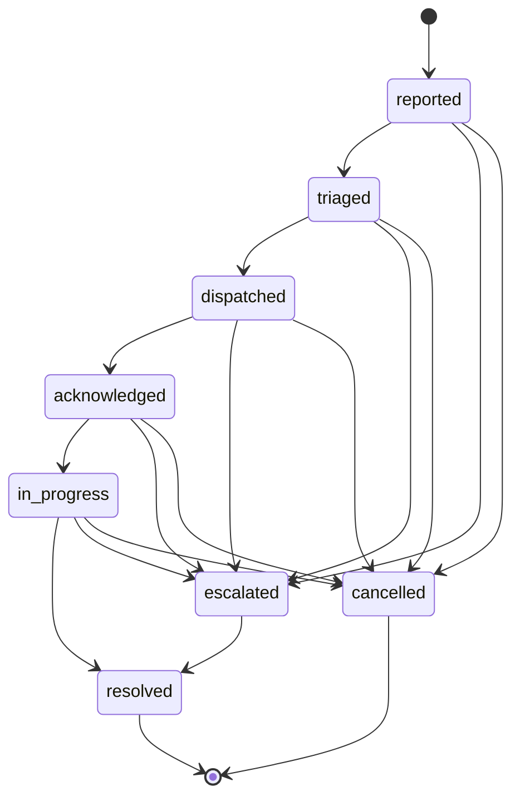

# CrewLink AI — API Specification
**Doc #5** · Status: Complete

Contract between the FastAPI backend (Doc #2) and the React/TS frontend — every schema below matches what the backend actually returns. Nothing here requires reading backend source.

## At a Glance

| Feature (PRD, Doc #1) | Primary endpoint(s) |
|---|---|
| Live priority-ranked task feed | `GET /incidents/feed`, `/ws/tasks` |
| AI triage + dispatch | `POST /incidents` → `POST /incidents/{incident_id}/dispatch-recommendation` |
| Multilingual chat bridge | `POST /chat-sessions`, `POST /chat-sessions/{session_id}/messages`, `/ws/chat/{session_id}` |
| Ask CrewLink (RAG assistant) | `POST /knowledge-base/ask` |
| Supervisor rollup | `GET /incidents`, `GET /zones`, `/ws/supervisor` |

---

## 1. Conventions

### 1.1 Base URL
```
https://{api-host}/api/v1
```
All REST endpoints below are relative to this. `{api-host}` is the Render Starter or Railway deployment (Doc #2) — the frontend reads it from `VITE_API_BASE_URL`, never hardcodes it. WebSocket channels share the host on `wss://` (Section 3). All bodies are `application/json` unless stated otherwise.

### 1.2 Resource ID convention
IDs are opaque, type-prefixed strings — treat as opaque, don't parse structure out of them.

| Prefix | Resource |
|---|---|
| `vol_` | Volunteer |
| `zone_` | Zone |
| `inc_` | Incident |
| `shift_` | Shift |
| `chat_` | Chat Session |
| `msg_` | Chat Message |
| `cdr_` | Crowd Density Reading |
| `kbdoc_` | Knowledge Base Document |
| `kbchunk_` | Knowledge Base Chunk (citation-only, see 2.1) |

### 1.3 Auth header format
```
Authorization: Bearer <access_token>
```
- Access tokens: JWT, 60 min TTL. Claims: `sub` (volunteer_id), `role` (`volunteer` or `supervisor`), `zone_id` (assigned zone for volunteers; `null` for supervisors, who span every zone at the venue), `iat`, `exp`.
- Refresh tokens: opaque, server-side, 7-day TTL, exchanged via `POST /auth/refresh`.
- Per Doc #1/#4's assumptions, identity is mocked — no real FIFA accreditation system sits behind this. `badge_code` + `pin` stand in for a real credential.
- Every endpoint below is annotated `Public`, `Volunteer`, `Supervisor`, or a combination. Where a volunteer's own resource is scoped ("self only", "own zone"), the backend enforces it from the JWT claims, not from the request body.

### 1.4 Error envelope
Every non-2xx response:
```json
{
  "error": {
    "code": "SCREAMING_SNAKE_CASE_CODE",
    "message": "Developer-facing detail, safe to log",
    "user_message": "Ready-to-display copy for the volunteer/supervisor UI",
    "request_id": "req_8a12f0",
    "details": {}
  }
}
```
`details` is only populated for `VALIDATION_ERROR` (a field → issue map); otherwise `{}`. Full code-by-code mapping is Section 5.

### 1.5 Pagination
Cursor-based, applied identically to every list endpoint in this document:
```
GET /{resource}?limit=20&cursor=<opaque>
```
```json
{
  "data": [ ],
  "pagination": { "next_cursor": "string or null", "has_more": true, "limit": 20 }
}
```
`limit` max 100, default 20. The cursor opaquely encodes `(sort_key, id)` of the last row returned — `priority_score` for `/incidents/feed`, `created_at` for everything else. Chosen over offset/limit because the two highest-traffic lists (`/incidents/feed`, chat messages) reorder or grow while a client is mid-page; offset pagination skips or duplicates rows under concurrent writes, cursor pagination doesn't.

### 1.6 Rate-limit tiers
| Tier | Limit | Applies to |
|---|---|---|
| `AUTH` | 5 req/min per IP | `/auth/*` |
| `STANDARD` | 60 req/min per user | plain CRUD reads/writes |
| `REALTIME_POLL` | 30 req/min per user | polling-fallback reads behind a WS channel |
| `AI_FAST` | 30 req/min per user | Fast/Cheap-tier calls (classification, translation) — target p95 latency <2s per Doc #1's NFRs |
| `AI_REASONING` | 10 req/min per user | Reasoning-tier calls (dispatch recommendation, Ask CrewLink, shift summaries) — target p95 latency <6s per Doc #1's NFRs |

Exceeding any tier returns `429` with `Retry-After` (Section 5).

---

## 2. REST Endpoints

### 2.1 Scope note — Doc #3's 11 entities, mapped
Six of Doc #3's eleven entities get a resource table below: **Volunteer, Zone, Incident, Shift, ChatSession, KnowledgeBaseDocument**. The remaining five map as follows and are *not* separately callable:
- **ChatMessage**, **KnowledgeBaseChunk** — nested under their parent (2.7, 2.8); chunks surface only as citations inside an Ask CrewLink answer.
- **CrowdDensityReading**, **VolunteerPositionPing** — sub-endpoints of Zones (2.4) and Volunteers (2.3) respectively.
- **Mock Data Simulator** feed, **AIInvocationLog** — no public endpoint. The simulator (Doc #2) writes `SIMULATED`-sourced rows directly into the service layer on a scheduler, not through this API. `AIInvocationLog` is an internal audit trail; the frontend only ever sees its shadow — the `confidence` / `fallback_used` fields on each AI response below.

### 2.2 Auth *(prerequisite — not one of the six modeled resources)*

| Method | Path | Purpose | Request | Response | Auth | Rate Limit |
|---|---|---|---|---|---|---|
| `POST` | `/auth/login` | Exchange mocked credential for tokens | `{badge_code, pin}` | `{access_token, refresh_token, token_type, expires_in, role, volunteer_id, zone_id}` | Public | `AUTH` |
| `POST` | `/auth/refresh` | Rotate an access token | `{refresh_token}` | `{access_token, expires_in}` | Public (valid refresh token) | `AUTH` |
| `POST` | `/auth/ws-ticket` | Issue a 30s single-use WS ticket | `{}` | `{ws_ticket, expires_in: 30}` | Volunteer\|Supervisor | `STANDARD` |

`ws-ticket` exists because browsers can't set custom headers on a WebSocket handshake, and a long-lived bearer JWT shouldn't sit in a URL or server log — full threat model in Doc #6. See 3.1 for the connect flow.

### 2.3 Volunteers

| Method | Path | Purpose | Request | Response | Auth | Rate Limit |
|---|---|---|---|---|---|---|
| `GET` | `/volunteers` | List (supervisor: venue-wide; volunteer: own zone only) | query: `zone_id?`, `status?`, `limit`, `cursor` | `{data: Volunteer[], pagination}` | Volunteer\|Supervisor | `STANDARD` |
| `GET` | `/volunteers/me` | Own profile | — | `Volunteer` | Volunteer\|Supervisor | `STANDARD` |
| `GET` | `/volunteers/{volunteer_id}` | One volunteer | — | `Volunteer` | Volunteer (self only)\|Supervisor | `STANDARD` |
| `PATCH` | `/volunteers/{volunteer_id}/status` | Update own availability | `{status}` | `Volunteer` | Volunteer (self only) | `STANDARD` |
| `PATCH` | `/volunteers/{volunteer_id}` | Edit profile / reassign zone | `{display_name?, languages?, zone_id?}` | `Volunteer` | Supervisor | `STANDARD` |
| `POST` | `/volunteers/{volunteer_id}/position-ping` | Report own coarse in-venue position (feeds dispatch proximity scoring) | `{zone_id, landmark_note?}` | `{accepted: true, recorded_at}` | Volunteer (self only) | `STANDARD` |

**`Volunteer`**
```json
{
  "id": "vol_4471",
  "badge_code": "string",
  "display_name": "Maria Alvarez",
  "role": "volunteer | supervisor",
  "languages": ["en", "es"],
  "zone_id": "zone_east_concourse",
  "status": "available | busy | off_shift",
  "current_incident_id": "inc_... or null",
  "shift_id": "shift_... or null",
  "created_at": "2026-07-11T08:00:00Z",
  "updated_at": "2026-07-11T14:22:04Z"
}
```
Background/non-logged-in volunteer positions used for demo texture are simulator-fed (`VolunteerPositionPing`, `SIMULATED`), not posted through this endpoint.

### 2.4 Zones

| Method | Path | Purpose | Request | Response | Auth | Rate Limit |
|---|---|---|---|---|---|---|
| `GET` | `/zones` | List all zones at the venue | query: `limit`, `cursor` | `{data: Zone[], pagination}` | Volunteer\|Supervisor | `STANDARD` |
| `GET` | `/zones/{zone_id}` | Zone detail incl. live rollup counts | — | `Zone` | Volunteer\|Supervisor | `STANDARD` |
| `GET` | `/zones/{zone_id}/volunteers` | Roster currently in a zone | query: `status?` | `{data: Volunteer[], pagination}` | Volunteer (own zone)\|Supervisor | `STANDARD` |
| `GET` | `/zones/{zone_id}/crowd-density` | Latest + recent density readings | query: `limit`, `cursor` | `{data: CrowdDensityReading[], pagination}` | Volunteer (own zone)\|Supervisor | `REALTIME_POLL` |

**`Zone`**
```json
{
  "id": "zone_east_concourse",
  "name": "East Concourse",
  "venue_section": "string",
  "active_volunteer_count": 6,
  "open_incident_count": 2,
  "current_crowd_density": "low | moderate | high | critical | null",
  "updated_at": "2026-07-11T14:20:00Z"
}
```
**`CrowdDensityReading`**
```json
{
  "id": "cdr_a190",
  "zone_id": "zone_east_concourse",
  "density_level": "low | moderate | high | critical",
  "raw_score": 0.62,
  "source": "SIMULATED | VOLUNTEER_REPORTED | SUPERVISOR_CREATED",
  "recorded_at": "2026-07-11T14:20:00Z"
}
```
Per Doc #3, any row with `source: "SIMULATED"` must carry a visible **SIMULATED** badge in the UI — that's why `source` is on every row, not just a header flag.

### 2.5 Incidents / Tasks

| Method | Path | Purpose | Request | Response | Auth | Rate Limit |
|---|---|---|---|---|---|---|
| `GET` | `/incidents/feed` | Caller's live, priority-ranked task feed | query: `category?`, `status?`, `limit`, `cursor` | `{data: Incident[], pagination}` | Volunteer | `REALTIME_POLL` |
| `GET` | `/incidents` | Filterable list (zone/status/category rollup) | query: `zone_id?`, `status?`, `category?`, `assigned_volunteer_id?`, `limit`, `cursor` | `{data: Incident[], pagination}` | Volunteer (own zone)\|Supervisor | `REALTIME_POLL` |
| `GET` | `/incidents/{incident_id}` | One incident | — | `Incident` | Volunteer (own zone/assignee)\|Supervisor | `STANDARD` |
| `POST` | `/incidents` | Report an incident; runs Fast/Cheap classification synchronously | `IncidentCreate` | `Incident` | Volunteer\|Supervisor | `AI_FAST` |
| `POST` | `/incidents/{incident_id}/dispatch-recommendation` | Run the Reasoning-tier dispatch recommender | `{exclude_volunteer_ids?: []}` | `DispatchRecommendation` | Supervisor (also auto-triggered server-side right after triage) | `AI_REASONING` |
| `PATCH` | `/incidents/{incident_id}/assign` | Manually assign/override responder | `{volunteer_id}` | `Incident` | Supervisor | `STANDARD` |
| `PATCH` | `/incidents/{incident_id}/status` | Transition lifecycle status | `{status, note?}` | `Incident` | Volunteer (assignee)\|Supervisor | `STANDARD` |

**Lifecycle** (Doc #2) — `resolved` and `cancelled` are the only terminal states; `escalated` can still resolve once handled:


**`Incident`**
```json
{
  "id": "inc_9c31de",
  "category": "medical | lost_fan | translation | accessibility | crowd_queue | lost_item | general | null",
  "status": "reported | triaged | dispatched | acknowledged | in_progress | resolved | escalated | cancelled",
  "priority_score": 54,
  "source": "SIMULATED | VOLUNTEER_REPORTED | SUPERVISOR_CREATED",
  "zone_id": "zone_east_concourse",
  "reported_by_volunteer_id": "vol_4471 or null",
  "assigned_volunteer_id": "vol_5820 or null",
  "dispatch_rationale": "string or null",
  "requires_emergency_escalation": false,
  "description": "string",
  "location_note": "string or null",
  "classification": {
    "model_tier": "fast_cheap",
    "tool_call": "classify_incident",
    "urgency_signal": "critical | high | medium | low",
    "confidence": 0.91,
    "reasoning_summary": "string, under 200 chars",
    "fallback_used": false
  },
  "created_at": "2026-07-11T14:22:03Z",
  "updated_at": "2026-07-11T14:22:04Z",
  "resolved_at": "iso8601 or null"
}
```
**`IncidentCreate`**
```json
{
  "description": "string, required",
  "zone_id": "zone_..., required",
  "category_hint": "string or null — volunteer's own guess; classifier may override",
  "location_note": "string or null"
}
```
Two fields are deliberately never client-supplied:
- `source` — the server sets it from the caller's role (`VOLUNTEER_REPORTED` / `SUPERVISOR_CREATED`); `SIMULATED` is reserved for the internal simulator credential.
- `priority_score` and `requires_emergency_escalation` — both are **deterministic**, computed from `classification.category`/`urgency_signal` plus current zone crowd density plus incident age (Doc #3: "priority score is deterministic, not a raw model output"). The classifier itself never emits a number or an escalate/don't-escalate boolean directly — this keeps that safety-critical decision auditable and outside the model's direct control, per Doc #4.

**`DispatchRecommendation`** — response of `POST /incidents/{id}/dispatch-recommendation`
```json
{
  "incident_id": "inc_9c31de",
  "model_tier": "reasoning",
  "tool_call": "recommend_dispatch",
  "recommended_volunteer_id": "vol_5820",
  "confidence": 0.88,
  "auto_assigned": true,
  "rationale": "vol_5820 is the nearest available volunteer in East Concourse with accessibility-services training and no active task.",
  "alternates": [
    { "volunteer_id": "vol_5820", "score": 0.88 },
    { "volunteer_id": "vol_6002", "score": 0.71 }
  ],
  "kb_context_used": true,
  "fallback_used": false,
  "incident_status_after": "dispatched"
}
```
`auto_assigned` is `true` iff `confidence >= 0.75` (configurable). Below threshold, the incident stays `triaged` with `assigned_volunteer_id: null`, this response is pushed to `/ws/supervisor` as a suggestion, and a supervisor confirms via `PATCH /incidents/{id}/assign`.

### 2.6 Shifts

| Method | Path | Purpose | Request | Response | Auth | Rate Limit |
|---|---|---|---|---|---|---|
| `GET` | `/shifts` | List (self; or by zone/date for supervisor) | query: `volunteer_id?`, `zone_id?`, `date?`, `limit`, `cursor` | `{data: Shift[], pagination}` | Volunteer (self)\|Supervisor | `STANDARD` |
| `GET` | `/shifts/{shift_id}` | One shift | — | `Shift` | Volunteer (own)\|Supervisor | `STANDARD` |
| `POST` | `/shifts` | Schedule a shift | `ShiftCreate` | `Shift` | Supervisor | `STANDARD` |
| `PATCH` | `/shifts/{shift_id}` | Reschedule / edit | `{scheduled_start?, scheduled_end?, zone_id?, status?}` | `Shift` | Supervisor | `STANDARD` |
| `POST` | `/shifts/{shift_id}/checkin` | Volunteer checks in | `{}` | `Shift` | Volunteer (self) | `STANDARD` |
| `POST` | `/shifts/{shift_id}/checkout` | Volunteer checks out | `{}` | `Shift` | Volunteer (self) | `STANDARD` |
| `GET` | `/shifts/{shift_id}/summary` | AI shift summary (Reasoning tier) | — | `ShiftSummary` | Volunteer (own)\|Supervisor | `AI_REASONING` |

**`Shift`**
```json
{
  "id": "shift_7710",
  "volunteer_id": "vol_4471",
  "zone_id": "zone_east_concourse",
  "scheduled_start": "2026-07-11T08:00:00Z",
  "scheduled_end": "2026-07-11T16:00:00Z",
  "actual_start": "2026-07-11T07:58:00Z",
  "actual_end": "iso8601 or null",
  "status": "scheduled | active | completed | no_show",
  "incident_count": 4,
  "summary_available": true
}
```
**`ShiftCreate`**
```json
{
  "volunteer_id": "vol_...",
  "zone_id": "zone_...",
  "scheduled_start": "iso8601",
  "scheduled_end": "iso8601"
}
```
**`ShiftSummary`**
```json
{
  "shift_id": "shift_7710",
  "model_tier": "reasoning",
  "tool_call": "summarize_shift",
  "summary": "string — plain-language recap of the shift",
  "incident_ids": ["inc_9c31de", "inc_..."],
  "generated_at": "iso8601",
  "fallback_used": false
}
```

### 2.7 Chat Sessions

| Method | Path | Purpose | Request | Response | Auth | Rate Limit |
|---|---|---|---|---|---|---|
| `POST` | `/chat-sessions` | Open a translation-bridge session | `ChatSessionCreate` | `ChatSession` | Volunteer | `STANDARD` |
| `GET` | `/chat-sessions` | List own (or zone, supervisor) sessions | query: `status?`, `limit`, `cursor` | `{data: ChatSession[], pagination}` | Volunteer (own)\|Supervisor | `STANDARD` |
| `GET` | `/chat-sessions/{session_id}` | Session detail | — | `ChatSession` | Volunteer (participant)\|Supervisor | `REALTIME_POLL` |
| `GET` | `/chat-sessions/{session_id}/messages` | Paginated history (WS polling fallback) | query: `limit`, `cursor` | `{data: ChatMessage[], pagination}` | Volunteer (participant)\|Supervisor | `REALTIME_POLL` |
| `POST` | `/chat-sessions/{session_id}/messages` | Send + translate a message | `ChatMessageCreate` | `ChatMessage` | Volunteer (participant) | `AI_FAST` |
| `PATCH` | `/chat-sessions/{session_id}/close` | Close session | `{}` | `ChatSession` | Volunteer (participant)\|Supervisor | `STANDARD` |

**`ChatSession`**
```json
{
  "id": "chat_2201",
  "volunteer_id": "vol_4471",
  "zone_id": "zone_east_concourse",
  "fan_display_name": "string or null",
  "volunteer_language": "en",
  "fan_language": "es",
  "status": "active | closed",
  "created_at": "iso8601",
  "closed_at": "iso8601 or null"
}
```
**`ChatSessionCreate`**
```json
{
  "zone_id": "zone_east_concourse",
  "fan_language": "es",
  "fan_display_name": "string or null",
  "volunteer_language": "string or null — defaults to the caller's primary registered language"
}
```
**`ChatMessage`**
```json
{
  "id": "msg_77c1",
  "session_id": "chat_2201",
  "sender": "volunteer | fan",
  "original_text": "string",
  "original_language": "es",
  "translated_text": "string",
  "translated_language": "en",
  "model_tier": "fast_cheap",
  "tool_call": "translate_message",
  "confidence": 0.97,
  "emergency_flag": false,
  "fallback_used": false,
  "created_at": "iso8601"
}
```
**`ChatMessageCreate`**
```json
{
  "sender": "volunteer | fan",
  "original_text": "string",
  "original_language": "string (ISO 639-1) or null — defaults to that side's session language"
}
```

### 2.8 Knowledge Base

| Method | Path | Purpose | Request | Response | Auth | Rate Limit |
|---|---|---|---|---|---|---|
| `GET` | `/knowledge-base/documents` | List KB documents (metadata) | query: `category?`, `limit`, `cursor` | `{data: KnowledgeBaseDocument[], pagination}` | Volunteer\|Supervisor | `STANDARD` |
| `GET` | `/knowledge-base/documents/{doc_id}` | Full document content | — | `KnowledgeBaseDocument` (with `content`) | Volunteer\|Supervisor | `STANDARD` |
| `POST` | `/knowledge-base/ask` | Ask CrewLink — retrieval-grounded Q&A (Reasoning tier) | `{question, zone_id?}` | `AskCrewLinkAnswer` | Volunteer\|Supervisor | `AI_REASONING` |

**`KnowledgeBaseDocument`**
```json
{
  "id": "kbdoc_0004",
  "title": "Accessibility Services Guide",
  "category": "venue_guide | safety_procedure | accessibility | faq",
  "chunk_count": 7,
  "is_simulated_content": true,
  "content": "string — full text, only on the single-document GET",
  "updated_at": "iso8601"
}
```
**`AskCrewLinkAnswer`**
```json
{
  "answer": "string or null",
  "grounded": true,
  "confidence": 0.83,
  "sources": [
    { "document_id": "kbdoc_0004", "chunk_id": "kbchunk_0031", "title": "Accessibility Services Guide" }
  ],
  "fallback_message": "string or null — populated only when grounded is false"
}
```
Per Doc #4's grounding boundary: generation never runs without a non-empty, above-threshold Chroma retrieval. If retrieval comes back empty or below threshold, the response is still `200 OK` with `grounded: false`, `answer: null`, and a `fallback_message` — never a hallucinated guess.

---

## 3. WebSocket Channels

### 3.1 Connecting
1. `POST /auth/ws-ticket` (Bearer JWT) → `{ws_ticket, expires_in: 30}`.
2. Connect within 30s: `wss://{api-host}/api/v1/ws/{channel}?ticket={ws_ticket}`. The ticket is single-use.
3. If the session's JWT expires mid-connection, the server sends close code `4401` (reason `token_expired`). The client re-issues a ticket and reconnects; until then, it falls back to the REST polling-equivalent listed below.

### 3.2 Channels

| Channel | Path | Subscriber role | REST polling fallback |
|---|---|---|---|
| Task feed | `/ws/tasks` | Volunteer | `GET /incidents/feed` |
| Chat bridge | `/ws/chat/{session_id}` | Volunteer (session participant) | `GET /chat-sessions/{session_id}/messages` |
| Supervisor dashboard | `/ws/supervisor` | Supervisor | `GET /incidents` + `GET /zones` |

### 3.3 Event envelope
```json
{ "event": "string", "data": {}, "emitted_at": "iso8601" }
```

### 3.4 Events by channel

**`/ws/tasks`** (volunteer)
- `incident.created` — new incident lands in this volunteer's zone/feed → `data: Incident`
- `incident.updated` — status, assignment, or `priority_score` changed → `data: Incident`
- `incident.resolved` — terminal state reached → `data: Incident`
- `emergency.broadcast` — see 3.5

**`/ws/chat/{session_id}`** (volunteer, session participant)
- `message.sent` — new `ChatMessage` persisted, translation included → `data: ChatMessage`
- `session.closed` → `data: ChatSession`
- `emergency.broadcast` — fires when a message's `emergency_flag` is true; see 3.5

**`/ws/supervisor`** (supervisor)
- `incident.created` / `incident.updated` / `incident.resolved` — venue-wide, same payloads as above
- `volunteer.status_changed` → `data: Volunteer`
- `zone.crowd_density_updated` → `data: CrowdDensityReading`
- `emergency.broadcast` — every escalation, venue-wide

### 3.5 Emergency broadcast
```json
{
  "event": "emergency.broadcast",
  "data": {
    "incident_id": "inc_9c31de",
    "zone_id": "zone_east_concourse",
    "category": "medical",
    "escalation_channel": "EMS | SECURITY",
    "message": "string — ready to display as-is",
    "origin": "incident_pipeline | chat_bridge"
  },
  "emitted_at": "iso8601"
}
```
This is deterministic and non-generative (Doc #4) — it bypasses the Reasoning-tier Dispatch Recommender entirely. The Translation Bridge's `emergency_flag` (2.7) fires the identical event, so a language barrier never delays escalation. When `origin` is `chat_bridge`, the backend auto-creates a matching `Incident` (`source: VOLUNTEER_REPORTED`, `status: escalated`) so it still shows up in `GET /incidents` and on `/ws/tasks`.

Delivery to EMS/security is retried server-side and alerted to on-call ops if it keeps failing — the reporting client always gets back a confirmed `escalated` status and is never shown a delivery error, so nothing casts doubt during a safety-critical moment.

---

## 4. AI-Specific Endpoints

All three calls below are Pydantic-schema tool calls with forced tool choice, validated again in application code, and regression-tested against Doc #4's 15-case golden set in CI — the shapes here are contract-stable.

### 4.1 Incident classifier — `POST /incidents`

Request:
```http
POST /api/v1/incidents
Authorization: Bearer <volunteer JWT>

{
  "description": "Fan in a wheelchair can't locate the accessible seating entrance near Section 112",
  "zone_id": "zone_east_concourse",
  "location_note": "Section 112 main gate",
  "category_hint": null
}
```

Response (`201 Created`):
```json
{
  "id": "inc_9c31de",
  "category": "accessibility",
  "status": "triaged",
  "priority_score": 54,
  "source": "VOLUNTEER_REPORTED",
  "zone_id": "zone_east_concourse",
  "reported_by_volunteer_id": "vol_4471",
  "assigned_volunteer_id": null,
  "dispatch_rationale": null,
  "requires_emergency_escalation": false,
  "description": "Fan in a wheelchair can't locate the accessible seating entrance near Section 112",
  "location_note": "Section 112 main gate",
  "classification": {
    "model_tier": "fast_cheap",
    "tool_call": "classify_incident",
    "urgency_signal": "medium",
    "confidence": 0.91,
    "reasoning_summary": "Wayfinding/accessibility request, no distress language detected.",
    "fallback_used": false
  },
  "created_at": "2026-07-11T14:22:03Z",
  "updated_at": "2026-07-11T14:22:04Z",
  "resolved_at": null
}
```
Because `requires_emergency_escalation` is `false`, the backend immediately queues this incident for the Dispatch Recommender (below) instead of a broadcast.

**Emergency variant, for contrast:** the same endpoint, given a description like *"Elderly fan collapsed near Gate 14, unresponsive,"* returns `category: "medical"`, `classification.urgency_signal: "critical"` and, at the root, `requires_emergency_escalation: true`, `status: "escalated"`. In that case, `dispatch-recommendation` below is never called — the emergency broadcast (3.5) fires instead.

### 4.2 Dispatch recommender — `POST /incidents/{incident_id}/dispatch-recommendation`

Request:
```http
POST /api/v1/incidents/inc_9c31de/dispatch-recommendation
Authorization: Bearer <supervisor JWT>

{}
```

Response (`200 OK`):
```json
{
  "incident_id": "inc_9c31de",
  "model_tier": "reasoning",
  "tool_call": "recommend_dispatch",
  "recommended_volunteer_id": "vol_5820",
  "confidence": 0.88,
  "auto_assigned": true,
  "rationale": "vol_5820 is the nearest available volunteer in East Concourse with accessibility-services training and no active task.",
  "alternates": [
    { "volunteer_id": "vol_5820", "score": 0.88 },
    { "volunteer_id": "vol_6002", "score": 0.71 }
  ],
  "kb_context_used": true,
  "fallback_used": false,
  "incident_status_after": "dispatched"
}
```

**Fallback variant** — Reasoning tier times out or errors:
```json
{
  "incident_id": "inc_9c31de",
  "model_tier": null,
  "tool_call": null,
  "recommended_volunteer_id": "vol_5820",
  "confidence": null,
  "auto_assigned": true,
  "rationale": "Reasoning-tier call timed out — assigned via deterministic nearest-available-in-zone fallback.",
  "alternates": [],
  "kb_context_used": false,
  "fallback_used": true,
  "incident_status_after": "dispatched"
}
```
`fallback_used: true` is the "visibly-badged fallback" Doc #4 requires — the frontend should render a small "auto-assigned (backup logic)" tag rather than hide the degradation.

### 4.3 Translation bridge — `POST /chat-sessions/{session_id}/messages`

Request:
```http
POST /api/v1/chat-sessions/chat_2201/messages
Authorization: Bearer <volunteer JWT>

{
  "sender": "fan",
  "original_text": "No encuentro la salida para silla de ruedas, ¿me puede ayudar?",
  "original_language": "es"
}
```

Response (`201 Created`):
```json
{
  "id": "msg_77c1",
  "session_id": "chat_2201",
  "sender": "fan",
  "original_text": "No encuentro la salida para silla de ruedas, ¿me puede ayudar?",
  "original_language": "es",
  "translated_text": "I can't find the wheelchair exit, can you help me?",
  "translated_language": "en",
  "model_tier": "fast_cheap",
  "tool_call": "translate_message",
  "confidence": 0.97,
  "emergency_flag": false,
  "fallback_used": false,
  "created_at": "2026-07-11T14:31:09Z"
}
```
If the same call detects distress language instead (e.g. a fan reporting they can't breathe), `emergency_flag` flips to `true` on this exact response shape — `emergency_flag` is a deterministic rule over the Fast/Cheap tier's urgency read, mirroring `requires_emergency_escalation` above, never a raw model boolean. The backend then fires `emergency.broadcast` (3.5) and auto-creates an `Incident` from the session's `zone_id`.

---

## 5. Error Handling Matrix

Two different failure philosophies apply here, deliberately:
- **AI calls with a deterministic fallback** (classification, translation, dispatch recommendation) never fail the HTTP request — a timeout or provider error is caught, the fallback runs, and the endpoint still returns `200`/`201` with `fallback_used: true`. Doc #4 requires a visibly-badged fallback at every AI call site; returning a 5xx here would just leave the frontend with nothing to render.
- **True infrastructure failure** (the fallback path itself can't run — e.g. the whole AI orchestration layer or the vector store is unreachable) is a real error and gets a real status code.

| Case | HTTP status | `error.code` | User-facing message | Notes |
|---|---|---|---|---|
| Missing/invalid/expired token | 401 | `AUTH_INVALID_TOKEN` | "Your session has expired — please log in again." | — |
| Valid token, wrong role/zone scope | 403 | `AUTH_INSUFFICIENT_SCOPE` | "You don't have access to this zone or action." | e.g. volunteer hitting a supervisor-only path |
| Resource not found | 404 | `RESOURCE_NOT_FOUND` | "We couldn't find that item." | — |
| Bad request body / bad enum value | 422 | `VALIDATION_ERROR` | "Please check the highlighted fields and try again." | `details` carries a field-to-issue map |
| Invalid lifecycle transition (e.g. `resolved` to `acknowledged`) | 409 | `INVALID_STATE_TRANSITION` | "This task already moved past that step — refreshing your view." | body includes current `Incident`/`Shift` so the client can just re-render |
| Two actors update the same row at once | 409 | `CONCURRENT_MODIFICATION` | "Someone else just updated this — here's the latest." | body includes latest state |
| Rate limit hit | 429 | `RATE_LIMIT_EXCEEDED` | "You're doing that a bit fast — try again in a few seconds." | `Retry-After` header set |
| AI call (Fast/Cheap or Reasoning) times out or errors, fallback available | 200 / 201 | *(none — not an error)* | UI renders a small "auto-assigned / backup translation" badge | `fallback_used: true` in body; see 4.1–4.3 |
| Ask CrewLink: retrieval empty or below threshold | 200 | *(none — not an error)* | Assistant says it doesn't have grounded info, suggests asking a supervisor | `grounded: false`, `answer: null`, `fallback_message` set |
| Knowledge base / Chroma store unreachable | 503 | `KB_STORE_UNAVAILABLE` | "Ask CrewLink can't reach the knowledge base right now — please ask your zone supervisor." | distinct from "no good match" above — this is the store itself being down |
| Whole AI orchestration layer unreachable (both tiers down) | 503 | `AI_ORCHESTRATION_UNAVAILABLE` | "AI assistance is temporarily unavailable — core reporting and chat still work." | classification/translation still fall back per above; only fully generative calls (Ask CrewLink, shift summary) have no fallback and surface this |
| WebSocket session expires mid-connection | close code `4401` | — | (silent client reconnect) | client re-issues a ws-ticket and reconnects; falls back to REST polling meanwhile |
| Emergency escalation delivery fails downstream | 201 (unchanged) | — | "Help is on the way." (unchanged) | retried + alerted to on-call ops server-side; never surfaced as a client-facing error — a safety-critical moment is the wrong place to introduce doubt |
